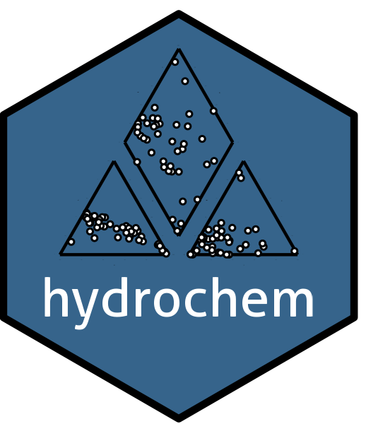

# hydrochem – Tools for Hydrochemical Data Analysis and Visualization

<!-- badges: start -->
[](https://CRAN.R-project.org/package=hydrochem)
[](https://cranlogs.r-pkg.org/downloads/total/last-month/hydrochem)
<!-- badges: end -->

The **hydrochem** package provides a set of tools for processing, analyzing, and visualizing hydrochemical data in a reproducible, programmatic workflow. It implements unit conversion, censored data management, ionic balance calculation, water type classification, and a range of hydrochemical indices useful for water quality assessment.

The package also offers advanced visualization functions for generating the standard diagrams used in hydrochemical interpretation: Piper, Durov, Stiff, Collins, Schoeller, Gibbs, and ternary diagrams.

Unlike existing solutions that rely on spreadsheets or proprietary graphical software, `hydrochem` is designed for scalability and reproducibility, lowering the technical barrier for hydrochemists working with datasets of varying complexity.

# Installation

The hydrochem package is available on [CRAN](https://cran.r-project.org/package=hydrochem) and can be installed with:

    install.packages("hydrochem")

To install the latest development version using the remotes package, run the following in your R console:

    remotes::install_github("snokarst-tools/hydrochem")

# Usage

## Quick example

```r
library(hydrochem)

# Compute the ionic balance
ion_balance(hc_data)

# Classify water types
classify_water_type(hc_data)

# Generate a Piper diagram
p <- plot_piper(hc_data)

# Save the diagram
save_plot(file.path(tempdir(), "piper.png"), type = "piper", plot = p)
```

# Main features

- **Unit conversion** for common hydrochemical units
- **Censored data handling**
- **Ionic balance calculation**
- **Water type classification**
- **Hydrochemical indices** relevant to water quality
- **Diagrams**: Piper, Durov, Stiff, Collins, Schoeller, Gibbs, ternary

# Citation

If you use `hydrochem` in your work, please cite it. Run `citation("hydrochem")` in R to get the appropriate reference.

# License

GPL-2
